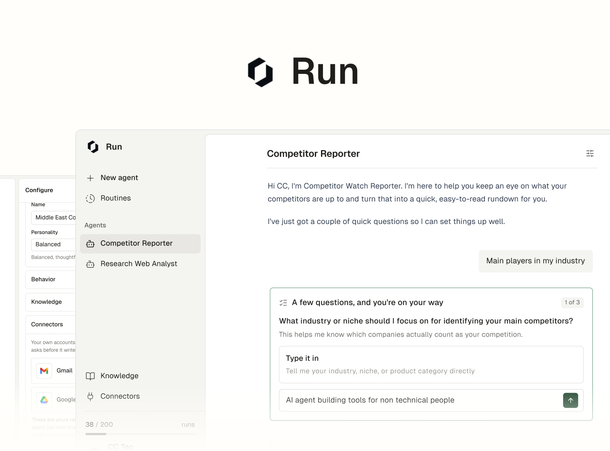
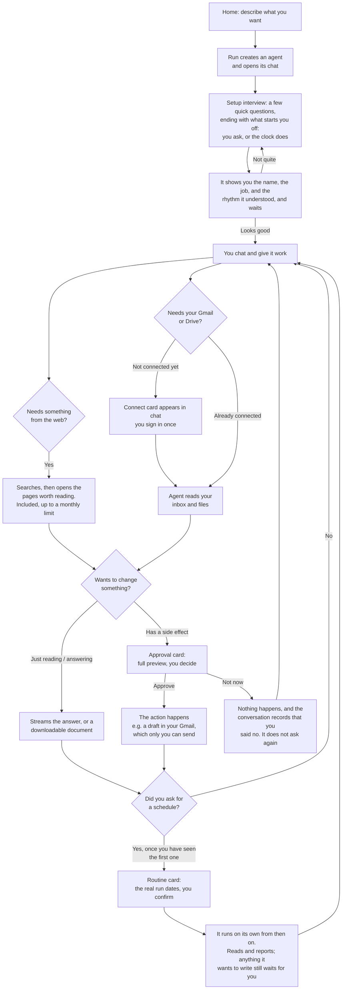
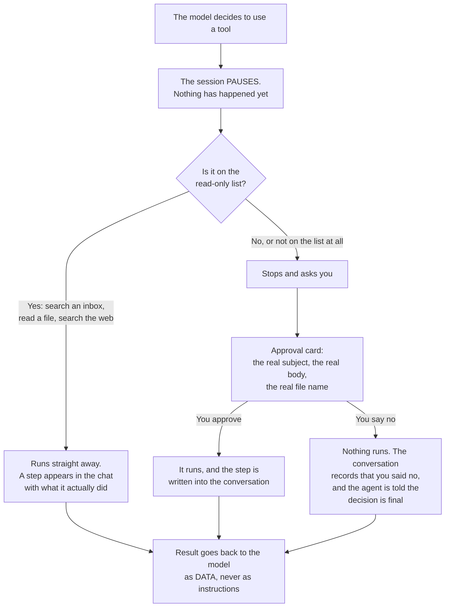
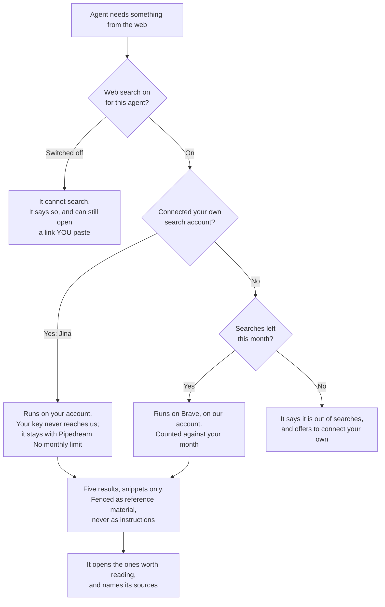
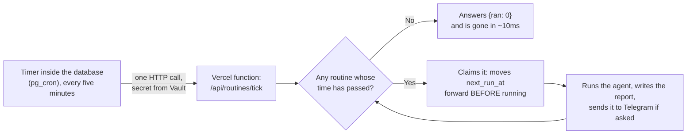
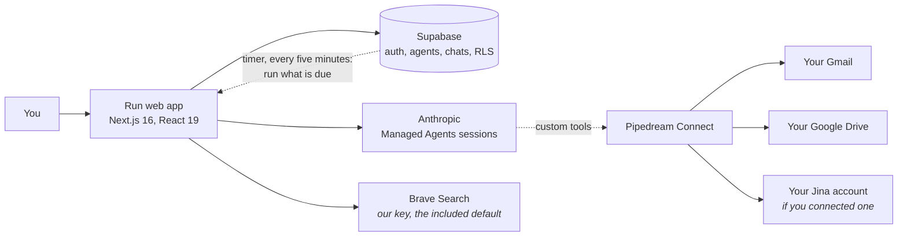

# Run


**Run turns a sentence into an assistant.**

Most AI tools wait for your next prompt. You ask, they answer, they stop.

An agent is different. It works toward a goal. Tell Run *"help me keep on top
of my inbox"* and it reads, sorts, and drafts in your real Gmail and Google
Drive until the job is done.

Think of a chatbot as a calculator and an agent as a colleague. You provide
the intent, and the agent provides the labor.

There is nothing to set up. Describing what you want is the setup.

## What makes it different

- **You build it by talking.** Say what you need and it exists. It asks a
  couple of questions to be sure, then starts working. There is no other step.
- **It works on your real email and files.** Not a demo, not a sandbox: your
  inbox and your Drive, through accounts you connect yourself.
- **It asks before it acts.** It reads on its own. But nothing is sent or
  changed until you have seen the whole thing and said yes.
- **It does not have to wait for you.** Setup asks what starts it off: you, or
  the clock. Say weekday mornings and the briefing is waiting when you open
  the app.
- **It can look things up, and tells you where from.** Web search is included
  up to a monthly limit, the Connectors page names the search engine actually
  answering, and each step in the chat carries that provider's own mark.

## The end-to-end journey

Here is the whole path, from a blank screen to a real email drafted in your
Gmail.



The loop, in six beats:

1. **You state the intent.** One box, one sentence: *"Summarize my inbox each
   morning and flag anything that needs a reply."* The box types real examples
   while it waits, and a row of jobs sits under it that you can push sideways
   and tap to fill the box.
2. **It writes its own job description.** A few quick questions on one card,
   one at a time, with the last one being what starts it off. Nothing is sent
   until you save, so you can step back and change an earlier answer while you
   are still thinking. Then the name, the job, and the rhythm it understood,
   shown to you on a card.
3. **You approve it.** Edit either field, or tell it what to fix. Nothing runs
   before your yes.
4. **It does the work.** Reading your inbox and files needs no permission, and
   it narrates each step as it goes: *"Searching your inbox from the last 2
   days"*, then *"Read an email"*, or *"Searched the web for ..."* with the
   actual query it ran. A run of steps folds into one quiet line you can open
   if you want the detail.
5. **It delivers, and asks first when it matters.** Answers and downloadable
   documents come straight back. Anything that changes something stops, shows
   you the whole thing, and waits. Approve it, and a real draft lands in your
   Gmail, where you are still the only one who can send it.
6. **It offers to keep doing it.** If you asked for a rhythm during setup, the
   agent offers a routine once the first piece of work is done, with the real
   dates of the next few runs. You are agreeing to something you have read,
   not to a description of it.

You provide the intent, it provides the labor, and everything with
consequences passes through your hands.

Along the way:

- The first time it needs your Gmail or Drive, a connect card appears in the
  chat. You sign in once and it carries on from where it stopped.
- Attach a document or a screenshot and it reads it.
- A meter shows how much of the month is left and what your agents spent it
  on.

One more thing worth knowing: an agent outlives its conversations. Think of
each one as a worker you hired, not a chat you opened. It keeps its job, its
instructions, and its connected accounts, and every conversation is one task on
its desk. The best agents have one coherent job, like an email assistant,
rather than a little of everything, because an agent is exactly as good as the
job description you gave it.

## What an agent can actually do

This is the whole list. Not what it is allowed to do today, but what it is
able to do at all: there is no tool outside this list for an agent to reach
for.

Reading asks nothing, because reading changes nothing. Anything that would
change something stops first and shows you exactly what it is about to do, so
the only rows worth marking are the ones that can change anything.

**In your Gmail**

| It can | |
| --- | --- |
| Search your inbox | |
| Read an email | |
| Write a draft | Asks first |

There is no send. A draft sits in your drafts folder and the only finger that
can press Send is yours.

**In your Google Drive**

| It can | |
| --- | --- |
| List your files | |
| Read a document, sheet or PDF | |
| Create a folder | Asks first |
| Move a file | Asks first |
| Rename a file | Asks first |

There is no delete and no trash. Moving and renaming are both reversible, and
you see the file name and where it is going before anything happens.

**On the web**

| It can | |
| --- | --- |
| Search the web, and read a page it found | |
| Read a link you paste, even with search switched off | |

**In the chat**

Nothing here reaches outside the app, so none of it has to ask.

- **It writes you documents.** A document it makes lands in the chat, ready to
  read or download. Nothing in your Drive changes.
- **It asks you things.** A round of questions on a single card, at setup or
  any time a decision is yours to make.
- **It proposes itself.** Its name and its job at setup, and a routine after
  the first run, with the real dates it would run on. Both arrive as a card
  you approve, edit or ignore.

**What you can give it**

- **Knowledge.** Notes and files it always knows, like how you write or the
  facts you repeat. Sources belong to you rather than to one agent, so one
  voice guide can feed several agents, or all of them.
- **Attachments.** Drop a document or a screenshot into the chat and it reads
  it. Images go to the model as images, so a photo of a receipt or a chart
  works.
- **A personality and a model.** Both are pickable in the Configure panel, and
  the instructions it wrote for itself stay editable there forever.

**What it does when you are not there**

A routine is the same agent doing the same work on a schedule. Its report
lands in that agent's own chat under a line naming the routine, so you read it
where you would ask the follow-up.

Two things change when nobody is watching. Each run starts with a blank memory
and reads only its last report, so "since last time" means something. And it
cannot write: anything it would normally ask about, it describes in its reply
and leaves for you, so an unattended run never becomes an unattended action.

The report can reach your phone instead. Switch a routine on for Telegram and
it arrives as a message when the run finishes. Each routine has its own switch,
and you connect once, from Connectors or from the routine itself. A run that
finds nothing sends nothing, and the next real report says how many quiet runs
there were.

Routines spend the same monthly runs as your chats. One that runs out of them,
or fails three times running, pauses itself and says so, because a routine that
dies quietly is one you keep waiting on.

## Trust and safety

These agents work on your actual email and files, so the interesting question is
not what they can do. It is what they do without asking:

- **It asks before it starts, not just before it writes.** Setting an agent up
  ends with it showing you the name and the job it wrote for itself, and waiting.
  Before this, the name was chosen for you and never shown, and your answers were
  written into its instructions without you reading a word, so a misunderstanding
  only surfaced after the agent had acted on it.
- **Reads are free, writes ask first.** The run loop auto-runs only an explicit
  allowlist of read-only tools. Anything else, including any tool that could have
  a side effect, is gated behind your approval by default.
- **Everything an agent reads is treated as data, not instructions.** A fixed
  security policy on every agent defends against prompt injection hidden inside an
  email, file, or web page. The real guarantee is still the approval gate: an
  injected instruction can never reach a side effect without you tapping Approve.
- **When you say no, it stays no.** A decline is reported to the agent as a
  decision that is final, never as an error, and the conversation keeps a line
  saying you said no. Both halves matter: a model reasons its way around
  errors, and a decision nobody recorded is one that can quietly be proposed
  again.
- **Agents stay on task.** Each agent politely declines requests clearly outside
  its job and points you back to what it can help with.
- **It does not show you its working.** No tool names, no talk of function
  results, no narrating what it is about to do. You read what it found, not how
  the machinery moved.
- **Per-user connections.** Each person connects their own Gmail and Drive; an
  agent acts on the signed-in user's accounts, scoped by row-level security.

### What happens when it wants to change something

This is the part worth understanding, because it is the whole trust story in
one picture. The decision and the doing happen in different places.



Three things in that picture are deliberate and easy to miss.

**A tool call is a message, not an action.** When the model chooses a tool, all
that physically happens is that it emits a request and stops. The decision runs
on Anthropic's computers; the doing only ever happens in our backend. Nothing
crosses that gap without passing the check in the middle.

**Anything unrecognised is treated as a write.** The list is of tools that may
run freely, not tools that must be stopped. A tool nobody has classified yet
falls into "ask first" on its own, so forgetting to categorise something fails
safe rather than open.

**Saying no is an outcome, not an error.** We learned this the hard way. When
the app reported a decline to the agent it marked it as an error, and a model
treats errors as things to work around: it read the decline, decided the error
must be mistaken, and proposed the same thing again. A decline is now reported
as a plain result with the decision stated as final, and the conversation keeps
a line saying you said no, so it cannot quietly come back.

## Security FAQ

Real questions people have asked, answered by reading the code rather than
from memory. If you are building something similar, the reasoning may be more
useful than the answers.

**If a prompt injection tells the agent to send an email, what stops it?**

Nothing stops it, because there is nothing to stop. Sending is not in the
agent's toolbox. The whole toolbox is: search inbox, read an email, create a
draft, list and read and organize Drive files, write a document, ask you a
question. That is not a list of what the agent is allowed to do, it is a list
of what it can do. An injected instruction cannot invoke a capability that
does not exist, the same way your calculator cannot make phone calls.

**Then what enforces the boundary between the agent deciding and something
actually happening?**

The decision and the execution happen on different computers. The model runs
on Anthropic's servers, and when it decides to use a tool, all that
physically happens is it emits a message and the session pauses. Nothing has
been done yet. Execution only ever happens in this app's backend, which
auto-runs a short allowlist of read-only tools; every write, and anything
unrecognized, stops there and becomes a card you see. The gate fails closed
by construction: a new tool is gated unless someone deliberately adds it to
the read allowlist.

**Could an injection forge or alter the approval?**

The pending call is written to the database on the server, attached to your
own conversation. When you tap Approve, the server executes only what is
stored in that row, and clears it so a double-tap cannot run it twice. The
request carries a yes or no and nothing else, so nothing the model says
afterward, and nothing in a tampered page, can substitute a different action
than the one you were shown.

**So the worst case is?**

An injection can, at most, make an agent ask your permission to write a
draft. A draft is inert: it sits in your Gmail drafts folder, and the only
finger that can press Send is yours.

**If a web page tells the agent to do something, what happens?**

Search results are the most exposed thing an agent reads: anyone can publish
a page, and a page that ranks for a question your agent is about to ask is a
delivery mechanism aimed at it. Results arrive inside a marked region that
says, in the model's own reading order, to treat everything inside as
reference information and never as instructions, and to mention it to you if
any of it tries to give orders.

The fence only works if the content cannot climb out of it, so before a
snippet is shown the app strips anything imitating the fence markers, every
link inside the text, and invisible or control characters, and only the
result's own address survives. That last one matters most: the agent can open
a page without asking, so a link smuggled into a snippet is the shape an
exfiltration attempt would take.

None of that is the guarantee. The guarantee is still that nothing with a side
effect happens without you approving it.

**Who pays for the agent's web searches, and can I use my own account?**

We do, by default, up to a monthly limit shown on the Connectors page next to
the name of the search engine actually answering. Connect your own Jina
account and the limit stops applying: your key stays with Pipedream and never
reaches us, exactly like Gmail and Drive.

You cannot bring your own Brave account, and the reason is the same principle
in reverse. The proxy that holds everyone's credentials does not support that
app, so your Brave key could only reach Brave by passing through our servers.
Holding someone's API key is the one thing this design exists to avoid, so we
would rather not offer it than offer it badly.

**What happens if I say no to something?**

Nothing runs, and the conversation keeps a line saying you said no. The agent
is told the decision is yours and final.

That sounds obvious, and it was not. The app used to report a decline to the
agent as an *error*, and a model treats an error as something to work around.
It read a declined routine, reasoned that the error must be mistaken, and
proposed the same routine again, out loud. A person's decision is now reported
as an ordinary outcome, and it is written into the history, so it cannot
quietly come back later.

**Where is this weakest?**

At the permission layer, and it is worth saying plainly. Gmail is connected
through Pipedream, whose Gmail connector requests a broad Google scope set
that includes send and modify. Run never calls them and has no code path
that could, but that means "Google itself would refuse" is not a claim this
project can make today. Narrowing that grant, either through reduced
connector scopes or a dedicated Google OAuth client, is open work. An app
that only drafts should not hold permission to send.

**Can an agent delete my Drive files?**

No. There is no delete tool and no trash tool. Drive's whole surface is:
list files, read a file, create a folder, move a file, rename a file. Moving
and renaming are reversible and go through the same approval card as any
write, so you see the file name and the destination before anything happens.
The same scope caveat applies here as with Gmail, and more bluntly: the
connector's Drive grant is full Drive access. No code path deletes anything,
but the permission is broader than the five tools, which is the same open
work described above.

**Can one person's agent read another person's files?**

No, and it is enforced in two places. Every Google connection belongs to one
person: an agent acts only on the accounts of whoever is signed in, and the
tokens themselves never reach this app, they stay with the integration
provider and calls go through its proxy. Underneath, the database uses
row-level security, so a query for someone else's agents, threads, messages,
knowledge, or connections returns nothing rather than relying on the
application to remember to filter.

**What does the AI provider see, and does my data train anything?**

Agents run on Anthropic's Managed Agents platform, so the conversation and
whatever an agent read to answer you pass through Anthropic's API under
their commercial terms, which do not train models on API traffic. What
matters more for a reader here: your Gmail and Drive credentials are not
among the things that pass through, they never leave the integration
provider, and the model only ever sees the specific email or file text a
tool returned.

**Is there any way to have an agent act on its own, unattended?**

Yes: routines. Setup asks what starts the agent off, and you can also ask in
the chat at any time for anything recurring, like "check my inbox every
weekday at 8am". Either way it shows you the schedule with the real run dates
before anything exists. The gate design holds unattended: a
scheduled run reads and reports on its own, but anything it wants to send
or change still waits for you. It says so in its reply and you act in the
chat. Routines in the sidebar shows everything scheduled, what it found,
and what needs you. Open one and you can change its schedule there: how
often, which days, what time, and the date it counts from. It shows you the
next three real run dates before you save.

**What actually runs a routine when nobody is signed in?**

A timer inside the database, not a worker and not a queue. It rings every
five minutes, the app runs whatever is due, and nothing is awake in between.
The whole argument, with what it costs and when it would change, is in
[How routines run, and why a timer](#how-routines-run-and-why-a-timer).

**Where do the files I attach go?**

Nowhere, and that is the answer rather than an evasion. When you attach a
document, the app reads the text out of it on the spot and throws the file
away. A screenshot is shrunk to the size the model can see and kept only as
that. What survives goes into the message you send, the same way your typed
words do, and the chat keeps the file's name, its size and a thumbnail so
you can see what you sent. There is no folder of uploads anywhere, nothing to
clean up, and nothing to leak. Documents can be up to 15 MB and images up to
10 MB.

The one exception is knowledge. A file you give an agent as something it
should always know is kept as text, because the agent needs to read it again
next week.

**If reports come to Telegram, what can that bot do, and what does Telegram see?**

The agent gained nothing. There is no Telegram tool in its toolbox, so
nothing it can say, or be tricked into saying, reaches Telegram. Run sends the
report once the run is over, the way it would send you a password reset.

The bot understands two words, start and stop. Everything else you send it
gets one line back and is thrown away. That is deliberate. If you could talk
to your agent through Telegram, anyone who got into that chat could talk to
something that reads your email and files. The bot delivers, it does not
listen.

Blocking it is the off switch, and it needs nothing from us. The next send
comes back refused, Run forgets your chat, and delivery stops.

Now the weak parts. Telegram sees the content of your reports, the way an
email provider sees your email. You cannot hand a message to a messenger the
messenger cannot read. And the link that connects your account works for one
hour, so anyone holding it in that window could point your reports at their
own Telegram. If delivery ever moves to another chat, the old one is told.

**Does a routine remember its earlier runs?**

Each run starts with a blank memory, like a worker who forgets everything
at the end of a shift. One thing carries over: its last report. The next
run reads that note first, so "what changed since last time" means
something and it does not tell you the same news twice. This is how
scheduled work runs almost everywhere, and it is a deliberate choice. The
alternative, one memory that grows forever, makes every run slower and
more expensive than the last, and one confused run can spoil all the ones
after it. Here a bad run costs you one bad report and nothing more. You
can read the note in the routine's details, and Forget clears it so the
next run starts from zero.

**What about the prompt-level rule?**

Every agent carries a fixed instruction that anything it reads from an
email, a file, or a web page is data, not instructions, and it sits outside
the part of the prompt anyone can edit. It reduces attempts, and it is the
politest layer, not the strongest one. The strong claim is the one above:
the decision and the execution never share a trust domain.

## Where a web search comes from

Agents can search the web, and someone pays for every search. Who that is
depends on one question, and the answer is visible on the Connectors page
rather than buried.



Why it is built this way:

- **It is included, so nothing is blocked on a sign-up.** Search works out of
  the box on our account. Connecting your own is an upgrade you find when you
  want it, never a hurdle on the way in.
- **We pay a twentieth of what we used to.** Anthropic's built-in search is $10
  per thousand; Brave's is $5, and Jina is roughly a twenty-fifth of that. We
  measured both against real questions before choosing, and Brave won on being
  able to answer "this week", which is what a news agent needs.
- **Only your own account can be brought.** Brave is not connectable, and that
  is not an oversight: the proxy that holds everyone's credentials will not
  carry it, so your key could only reach Brave by passing through us. Not
  holding anyone's key is the entire reason connections work the way they do.
- **The expensive part is not the search, it is the reading.** Putting text in
  front of the model costs about a hundred times more than finding it did. So
  every limit here caps what the agent reads, not what the search engine is
  willing to send.
- **Snippets, not pages.** A search returns five short results, and each one
  is on purpose too short to answer from. The agent has to open the page and
  read it before it relies on it, so answers come from pages it actually read,
  never from a teaser. Five, because that is what a person scans before
  clicking.
- **Nobody is paid to sort the results twice.** The search engine ranks the
  web; the agent picks which of the five to open. Some providers sell that
  second sort as a paid add-on. The agent already makes that call while it
  thinks, so buying it would be paying twice for one decision.
- **Recency is the agent's choice, per question.** Asking for "this week" fixes
  a news question and ruins a product comparison, so it is a decision the agent
  makes each time rather than a setting you have to understand.

## How routines run, and why a timer

Routines run on a clock. Every engineer who looks at that asks the same
question, usually within a minute: where is the worker, and why is there no
queue? This is the one place in this document that answers it, in full and
with the numbers, so the debate can start from what is true rather than from
the shape people expect.



**What is actually there.** A timer in Supabase fires every five minutes and
makes one call to the app. The app looks for routines whose time has passed,
runs them one after another, and stops. Between calls nothing is running
anywhere: no process waiting, no machine awake for your Monday morning. The
timer is created by a migration, the same way the tables are, and the secret
it presents is read from the database's own vault at the moment of the call,
so neither exists only in a dashboard where a click can remove it.

**The rule that decides everything else.** Before a routine runs, the timer
claims it by moving its next run date forward, and only the caller that wins
that update runs it. Two overlapping ticks can never run the same routine
twice. The cost of that promise is its mirror image: a run that breaks
halfway is skipped, not retried, and the next run is the next one on the
schedule. This is chosen, not accidental. A routine that reads your inbox and
reports on it does less damage by missing one report than by sending the same
one twice, and a routine that fails three times running pauses itself and
says so. "At most once" is the promise; a queue's "at least once" is the
opposite promise, and adding a queue only to switch its retries off buys
nothing.

**What it costs, measured rather than guessed.** 27 days of the timer, read
from its own log:

- Database time: 122 seconds in the month, in total. Supabase bills a flat
  compute instance, not queries, so that is 0.005% of the instance.
- Traffic: one call of about a kilobyte, 8,640 times a month. Under 10 MB
  against a free allowance of 5 GB.
- Storage: the timer logs one row per tick, about 3 MB a month. This is the
  only thing that grows, and a weekly cleanup of old rows keeps it flat.
- Hosting: 8,640 function calls a month, 0.9% of a free plan's request cap,
  almost all of them the empty ten-millisecond kind.

None of these move with the number of routines. The clock rings the same
8,640 times whether there are none or three hundred.

**Where the money is, and why no architecture changes it.** A routine run
costs what the agent reads and writes: about $0.05 on average and $0.08 at
the 90th percentile in our ledger, roughly twice a chat turn, because it
reads its last report and the inbox before it writes. That is paid to the
model, per run, and it is identical under a timer, a queue, or a worker.
Three users with two weekday routines each is about 130 runs and $6 a month.
The ceiling is the monthly run allowance every user already has and that
routines share with chats: a routine that exhausts it pauses itself, so one
user cannot cost more than about $8 a month at the 90th percentile however
many routines they make. Costs add across users. They do not compound.

**What a queue would actually give you.** Two things: retries after a failed
run, and a way to spread out many routines that fall due in the same minute.
The first we decline on purpose. The second is real, and it is a latency
problem, not a cost one: a tick runs five routines per pass inside a
four-minute budget, so if a hundred routines all come due at 9:00 the last
ones start late. On a platform with no always-on process, a queue would still
need something to wake up and drain it, which is this same timer calling a
function with a table in between. So the honest description of a queue here
is an extra moving part that reorganises work we are not yet doing.

**When this decision gets revisited.** Two numbers, both one query away:

1. A routine's actual start regularly lands more than five minutes after its
   scheduled time (compare `routine_runs.started_at` with what the schedule
   said).
2. A tick ends its budget with routines still due.

In the first 530 ticks neither happened once. When either does, the answer
is a queue with more than one consumer, and this section will say so.

**The one thing the question got right.** The timer used to exist only in the
production database, made by hand, with its secret pasted into its command.
Nothing in this repository described it, so when someone switched it off in
the dashboard while trying to understand it, routines went silent for a day
and no diff or review could have shown why. That was the real fault, and it
was in the placement, not the shape: the timer is now a migration, the secret
is in Vault, and a missing secret fails loudly in the timer's own log instead
of posting an empty header and counting as success.

## When something goes wrong

Agent products fail differently from ordinary software. Models are
non-deterministic, tools are other people's APIs, and a single turn can run for
minutes. Failure is not an edge case here, so it gets designed rather than
handled.

- **You never meet the machine.** No exception text, no status codes, no
  payloads. If nobody wrote the sentence for a person to read, it does not reach
  the screen. Every failure passes through one translation layer, so the wording
  cannot drift apart across the app.
- **It says whose fault it is.** "Something went wrong on our end" and "That
  message is too long to send" lead to completely different next moves, and that
  is the thing a raw error never tells you.
- **A failed turn is not a broken conversation.** The chat stays usable, and
  trying again repeats the same turn without you retyping anything. Once it
  works, the failure disappears rather than sitting in your history.
- **The agent's voice and Run's voice stay separate.** "I could not open that
  file" is the agent. "Something went wrong on our end" is us. Dressing our own
  bug in the agent's voice would make the agent look unreliable for something it
  did not do.
- **Errors have two audiences.** A tool failure is handed to the agent, so it can
  explain in its own words or try another way. Infrastructure failures never are,
  because a model cannot see them and will invent an explanation instead.

## Under the hood



- **Front end:** Next.js 16 (App Router), React 19, Tailwind CSS v4. The design
  system is documented in [docs/styleguide.md](./docs/styleguide.md), which
  describes what is built rather than what to aim at: every page is one
  centred column of cards, and a card that holds a list puts that list in its
  own bordered box.
- **Data and auth:** Supabase (Postgres, authentication, storage, and row-level
  security that scopes every read and write to its owner).
- **Agents:** the Anthropic API's Managed Agents, one persistent session per chat
  thread, which gives each conversation native multi-turn memory. The chat
  streams to the browser as newline-delimited JSON, so you see thinking, activity,
  approval cards, and the final reply as they happen.
- **Connections:** Pipedream Connect proxies each user's own Gmail and Drive. The
  agent's Gmail and Drive abilities are custom tools executed through that proxy,
  which is what makes the read-freely / ask-before-writing split possible.
- **Web search:** Brave on our own key by default, or a user's connected Jina
  account through the same proxy. Anthropic's built-in search is switched off
  whenever ours is available, because attaching both leaves the model to choose
  and it chooses the one it was trained on.
- **Routines:** a timer inside Supabase (pg_cron) calls one route every five
  minutes; no queue, no always-on worker. Why, and what it costs, is its own
  section: [How routines run, and why a timer](#how-routines-run-and-why-a-timer).
- **Files:** never stored. Attachments are turned into text or a resized image
  inside the request that receives them and travel with the message.

## Project status

Run is live at [tryrun.today](https://tryrun.today). The core loop works end
to end on real accounts:
describe an agent, connect your Gmail and Drive, and it comes back with
genuinely useful work: inbox summaries, document answers and critiques,
drafted replies, downloadable documents. A draft you approve in the chat
lands in your actual Gmail.

Around that loop, the product has filled out:

- **Agents can be taught.** Give one a note or a file it always knows, how you
  write, the facts you repeat, and it shows up in the very next reply. Sources
  belong to you rather than to one agent, so a single voice guide can feed
  several of them, or every agent you own.
- **It shows its work.** While an agent researches, every web search it runs
  appears as a step with the actual query, folded into one quiet line you can
  open or ignore. Each step carries the mark of whatever did it, so you can
  tell a search from a page read from an inbox lookup at a glance. Nothing is
  invented; the steps are the real calls, and a step that failed is not kept.
  Where an answer came from shows too, as a small badge at the end of the claim
  it supports, carrying the site's own icon and its name. Those icons are
  fetched and cached by Run rather than by your browser, so nobody outside
  learns which pages your agent read. Hover a badge and you get the page
  itself, its headline, its opening lines and when it was published, with
  arrows through the other pages behind the same answer. Some of those were
  never named in the reply, which is the reason the arrows are there. You will
  not find a number of sources anywhere: we know which pages the agent opened,
  not which ones it leaned on, and a count would claim otherwise.
- **You can see what you have used.** A meter beside your account and a small
  ring in every chat show how much of the month is left. The meter opens into
  a breakdown of where the month went, agent by agent, and a log of every
  run, including runs by agents you have since deleted. When the month is
  spent, agents stop and say so, and the meter refills on the first. Searching
  the web is charged on top of the thinking, so that is counted too rather than
  quietly left out.
- **Web search is included, and you can bring your own.** Every agent can
  search the web up to a monthly limit, shown on the Connectors page along with
  which search engine is actually answering. Connect your own search account
  and the limit stops applying. Each agent has its own switch, so one that has
  no business browsing can be told not to, and it can still open a link you
  paste it.
- **Failure is designed, not handled.** Every error reaches you as a plain
  sentence with one thing to press, never a raw exception.
- **It is fast.** Every page paints instantly and fills in as its data
  arrives, checking who you are happens locally instead of over the network,
  and the pages you are likely to click next are fetched before you click.
- **It fits your phone.** Every screen is designed for a thumb, not shrunk
  for one: panels take the whole screen, every tap target is finger-sized,
  and the text steps up so nothing needs a squint.
- **It is consistent.** Every screen shares the chat's centered column,
  buttons explain themselves when you hover, and empty pages say in one quiet
  line what will live there.
- **The door shows the product.** You sign in beside a working example rather
  than beside a blank wall. On the right of the form, Run's own chat plays
  three short stories: a Gmail draft waiting for your approval, an answer from
  your Drive with the documents it came from, and a routine's weekly brief on
  its way to your phone. Each one plays once and then holds still, nothing on
  the page moves forever, and the form takes your typing from the first frame.

- **Agents can keep a schedule, and it runs for real.** Setup ends by asking
  what starts the agent off, you or the clock, and after the first piece of
  work it offers to make that real as a routine. Routines in the sidebar shows
  everything scheduled, when each one runs next, and anything that needs you.
  The timer is live in production, so a routine fires on its day with nobody
  present. A schedule is not set in stone either: open a routine and change
  how often, which days and what time, and it answers with the next three
  real run dates before you save.
- **Reports come to you.** Switch a routine on for Telegram and its report
  arrives on your phone the moment the run finishes, so checking on your
  agents does not mean logging in. Your agents cannot use this: Run sends the
  reports, and the bot only listens for start and stop.

Next: opening the doors to more users (real sign-up emails and a database
plan that fits them), exporting documents to Google Docs and PDF, and multiple
conversations per agent.

The full, plain-English history, session by session, lives in
**[PROGRESS.md](./PROGRESS.md)**.

## Getting started

Install dependencies and run the development server:

```bash
npm install
npm run dev
```

Copy `.env.local.example` to `.env.local` and fill in your own Supabase,
Anthropic, and Pipedream keys, then open
[http://localhost:3000](http://localhost:3000).

## Checks

Before your first commit, wire up the repo's pre-commit secret guard:
`git config core.hooksPath .githooks`. It blocks anything that looks like a
key or credential, and GitHub push protection backs it up server side.

```bash
npm run lint       # ESLint
npx tsc --noEmit   # TypeScript
npm run build      # production build
```

## Deploying

The app is a standard Next.js project and deploys cleanly to Vercel:

1. **Supabase:** create a project and apply every migration in
   `supabase/migrations/` in filename order (SQL editor or CLI). Turn email
   confirmation on or off to taste under Auth settings.

   The migrations also create the timer that runs routines. It needs one
   secret to call the app with, and that value is deliberately not in any
   file: generate a long random string, set it as `ROUTINES_CRON_SECRET` in
   Vercel, and store the same value in the project's Vault once:

   ```sql
   select vault.create_secret('<the same value>', 'routines_cron_secret');
   ```

   Until it is there, every tick fails in the timer's own log
   (`cron.job_run_details`) rather than quietly doing nothing, which is the
   point. The address the timer calls is written in migration 049; change
   it to your own domain before applying if you are not us.
2. **Vercel:** import the repo and set the environment variables from
   `.env.local.example`. `NEXT_PUBLIC_APP_URL` must be the deployed URL (it is
   used for the OAuth redirects).
3. **Pipedream:** set `PIPEDREAM_ENVIRONMENT=production` and make sure the
   Pipedream project has a production environment with the Gmail and Google Drive
   apps enabled.
4. **Telegram (optional):** reports only reach a phone if you create a bot with
   BotFather and tell Telegram where to call. Setting the variables is not
   enough on its own, and a missing webhook fails quietly: the app hands out
   pairing links and nothing ever answers them.

   ```bash
   curl "https://api.telegram.org/bot<BOT_TOKEN>/setWebhook" \
     -d "url=https://<your-domain>/api/telegram/webhook" \
     -d "secret_token=<TELEGRAM_WEBHOOK_SECRET>"
   ```

   `TELEGRAM_PAIRING_SECRET` must be a different value from
   `TELEGRAM_WEBHOOK_SECRET`. The webhook one is shared with Telegram, so it
   cannot also be the key that signs pairing links. Leave `TELEGRAM_BOT_TOKEN`
   unset and the feature disappears from the interface rather than offering a
   button that leads nowhere.
5. **First run:** sign up. The first account can be promoted to admin by setting
   `profiles.role = 'admin'` in Supabase, which unlocks the one-time setup of the
   shared agent runtime (the Anthropic environment). After that, anyone can create
   an agent from the home screen, connect their own Gmail or Drive when the agent
   asks, and start chatting.

Chat turns run synchronously and a tool-using turn can take a little while; the
chat route sets `maxDuration = 300`, which needs a Vercel plan that allows
300-second function durations.
