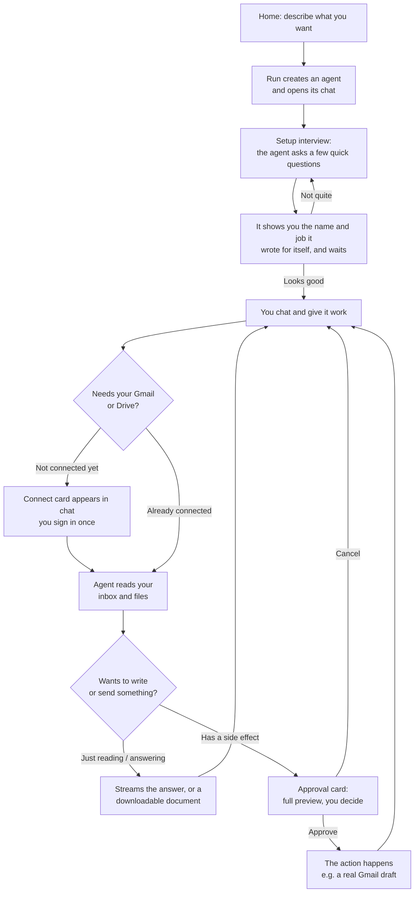
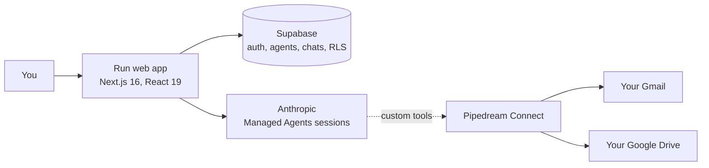

# Run


**Run turns a sentence into an assistant.**

Most AI tools wait for your next prompt. You ask, they answer, they stop.

An agent is different. It works toward a goal. Tell Run *"help me keep on top
of my inbox"* and it reads, sorts, and drafts in your real Gmail and Google
Drive until the job is done.

Think of a chatbot as a calculator and an agent as a colleague. You provide
the intent, and the agent provides the labor.

There is nothing to set up. Describing what you want is the setup.

## What makes it different

- **You build it by talking.** Say what you need and it exists. It asks a
  couple of questions to be sure, then starts working. There is no other step.
- **It works on your real email and files.** Not a demo, not a sandbox: your
  inbox and your Drive, through accounts you connect yourself.
- **It asks before it acts.** It reads on its own. But nothing is sent or
  changed until you have seen the whole thing and said yes.

## The end-to-end journey

Here is the whole path, from a blank screen to a real email drafted in your
Gmail.



The loop, in five beats:

1. **You state the intent.** One box, one sentence: *"Summarize my inbox each
   morning and flag anything that needs a reply."*
2. **It writes its own job description.** A few quick questions, then the name
   and the job it understood, shown to you on a card.
3. **You approve it.** Edit either field, or tell it what to fix. Nothing runs
   before your yes.
4. **It does the work.** Reading your inbox and files needs no permission, and
   it narrates each step as it goes: *"Searching your inbox from the last 2
   days"*, then *"Read an email"*.
5. **It delivers, and asks first when it matters.** Answers and downloadable
   documents come straight back. Anything that sends or changes something
   stops, shows you the whole thing, and waits. Approve it, and a real draft
   lands in your Gmail.

You provide the intent, it provides the labor, and everything with
consequences passes through your hands.

Along the way:

- The first time it needs your Gmail or Drive, a connect card appears in the
  chat. You sign in once and it carries on from where it stopped.
- Attach a document or a screenshot and it reads it.
- A meter shows how much of the month is left and what your agents spent it
  on.

One more thing worth knowing: an agent outlives its conversations. Think of
each one as a worker you hired, not a chat you opened. It keeps its job, its
instructions, and its connected accounts, and every conversation is one task on
its desk. The best agents have one coherent job, like an email assistant,
rather than a little of everything, because an agent is exactly as good as the
job description you gave it.

## Trust and safety

These agents work on your actual email and files, so the interesting question is
not what they can do. It is what they do without asking:

- **It asks before it starts, not just before it writes.** Setting an agent up
  ends with it showing you the name and the job it wrote for itself, and waiting.
  Before this, the name was chosen for you and never shown, and your answers were
  written into its instructions without you reading a word, so a misunderstanding
  only surfaced after the agent had acted on it.
- **Reads are free, writes ask first.** The run loop auto-runs only an explicit
  allowlist of read-only tools. Anything else, including any tool that could have
  a side effect, is gated behind your approval by default.
- **Everything an agent reads is treated as data, not instructions.** A fixed
  security policy on every agent defends against prompt injection hidden inside an
  email, file, or web page. The real guarantee is still the approval gate: an
  injected instruction can never reach a side effect without you tapping Approve.
- **Agents stay on task.** Each agent politely declines requests clearly outside
  its job and points you back to what it can help with.
- **Per-user connections.** Each person connects their own Gmail and Drive; an
  agent acts on the signed-in user's accounts, scoped by row-level security.

## Security FAQ

Real questions people have asked, answered by reading the code rather than
from memory. If you are building something similar, the reasoning may be more
useful than the answers.

**If a prompt injection tells the agent to send an email, what stops it?**

Nothing stops it, because there is nothing to stop. Sending is not in the
agent's toolbox. The whole toolbox is: search inbox, read an email, create a
draft, list and read and organize Drive files, write a document, ask you a
question. That is not a list of what the agent is allowed to do, it is a list
of what it can do. An injected instruction cannot invoke a capability that
does not exist, the same way your calculator cannot make phone calls.

**Then what enforces the boundary between the agent deciding and something
actually happening?**

The decision and the execution happen on different computers. The model runs
on Anthropic's servers, and when it decides to use a tool, all that
physically happens is it emits a message and the session pauses. Nothing has
been done yet. Execution only ever happens in this app's backend, which
auto-runs a short allowlist of read-only tools; every write, and anything
unrecognized, stops there and becomes a card you see. The gate fails closed
by construction: a new tool is gated unless someone deliberately adds it to
the read allowlist.

**Could an injection forge or alter the approval?**

The pending call is written to the database on the server, attached to your
own conversation. When you tap Approve, the server executes only what is
stored in that row, and clears it so a double-tap cannot run it twice. The
request carries a yes or no and nothing else, so nothing the model says
afterward, and nothing in a tampered page, can substitute a different action
than the one you were shown.

**So the worst case is?**

An injection can, at most, make an agent ask your permission to write a
draft. A draft is inert: it sits in your Gmail drafts folder, and the only
finger that can press Send is yours.

**Where is this weakest?**

At the permission layer, and it is worth saying plainly. Gmail is connected
through Pipedream, whose Gmail connector requests a broad Google scope set
that includes send and modify. Run never calls them and has no code path
that could, but that means "Google itself would refuse" is not a claim this
project can make today. Narrowing that grant, either through reduced
connector scopes or a dedicated Google OAuth client, is open work. An app
that only drafts should not hold permission to send.

**What about the prompt-level rule?**

Every agent carries a fixed instruction that anything it reads from an
email, a file, or a web page is data, not instructions, and it sits outside
the part of the prompt anyone can edit. It reduces attempts, and it is the
politest layer, not the strongest one. The strong claim is the one above:
the decision and the execution never share a trust domain.

## When something goes wrong

Agent products fail differently from ordinary software. Models are
non-deterministic, tools are other people's APIs, and a single turn can run for
minutes. Failure is not an edge case here, so it gets designed rather than
handled.

- **You never meet the machine.** No exception text, no status codes, no
  payloads. If nobody wrote the sentence for a person to read, it does not reach
  the screen. Every failure passes through one translation layer, so the wording
  cannot drift apart across the app.
- **It says whose fault it is.** "Something went wrong on our end" and "That
  message is too long to send" lead to completely different next moves, and that
  is the thing a raw error never tells you.
- **A failed turn is not a broken conversation.** The chat stays usable, and
  trying again repeats the same turn without you retyping anything. Once it
  works, the failure disappears rather than sitting in your history.
- **The agent's voice and Run's voice stay separate.** "I could not open that
  file" is the agent. "Something went wrong on our end" is us. Dressing our own
  bug in the agent's voice would make the agent look unreliable for something it
  did not do.
- **Errors have two audiences.** A tool failure is handed to the agent, so it can
  explain in its own words or try another way. Infrastructure failures never are,
  because a model cannot see them and will invent an explanation instead.

## Under the hood



- **Front end:** Next.js 16 (App Router), React 19, Tailwind CSS v4. The design
  system is documented in [docs/styleguide.md](./docs/styleguide.md).
- **Data and auth:** Supabase (Postgres, authentication, storage, and row-level
  security that scopes every read and write to its owner).
- **Agents:** the Anthropic API's Managed Agents, one persistent session per chat
  thread, which gives each conversation native multi-turn memory. The chat
  streams to the browser as newline-delimited JSON, so you see thinking, activity,
  approval cards, and the final reply as they happen.
- **Connections:** Pipedream Connect proxies each user's own Gmail and Drive. The
  agent's Gmail and Drive abilities are custom tools executed through that proxy,
  which is what makes the read-freely / ask-before-writing split possible.

## Project status

Run is live at [tryrun.today](https://tryrun.today). The core loop works end
to end on real accounts:
describe an agent, connect your Gmail and Drive, and it comes back with
genuinely useful work: inbox summaries, document answers and critiques,
drafted replies, downloadable documents. A draft you approve in the chat
lands in your actual Gmail.

Around that loop, the product has filled out:

- **Agents can be taught.** Give one a note or a file it always knows, how you
  write, the facts you repeat, and it shows up in the very next reply. Sources
  belong to you rather than to one agent, so a single voice guide can feed
  several of them, or every agent you own.
- **It shows its work.** While an agent researches, every web search it runs
  appears as a step with the actual query, folded into one quiet line you can
  open or ignore. Nothing is invented; the steps are the real calls.
- **You can see what you have used.** A meter beside your account and a small
  ring in every chat show how much of the month is left. The meter opens into
  a breakdown of where the month went, agent by agent, and a log of every
  run, including runs by agents you have since deleted. When the month is
  spent, agents stop and say so, and the meter refills on the first.
- **Failure is designed, not handled.** Every error reaches you as a plain
  sentence with one thing to press, never a raw exception.
- **It is fast.** Every page paints instantly and fills in as its data
  arrives, checking who you are happens locally instead of over the network,
  and the pages you are likely to click next are fetched before you click.
- **It fits your phone.** Every screen is designed for a thumb, not shrunk
  for one: panels take the whole screen, every tap target is finger-sized,
  and the text steps up so nothing needs a squint.
- **It is consistent.** Every screen shares the chat's centered column,
  buttons explain themselves when you hover, and empty pages say in one quiet
  line what will live there.

Next: opening the doors to more users (real sign-up emails and Google's app
verification), exporting documents to Google Docs and PDF, multiple
conversations per agent, and scheduled runs so an agent can work on its own
(a daily inbox summary that arrives without you asking).

The full, plain-English history, session by session, lives in
**[PROGRESS.md](./PROGRESS.md)**.

## Getting started

Install dependencies and run the development server:

```bash
npm install
npm run dev
```

Copy `.env.local.example` to `.env.local` and fill in your own Supabase,
Anthropic, and Pipedream keys, then open
[http://localhost:3000](http://localhost:3000).

## Checks

Before your first commit, wire up the repo's pre-commit secret guard:
`git config core.hooksPath .githooks`. It blocks anything that looks like a
key or credential, and GitHub push protection backs it up server side.

```bash
npm run lint       # ESLint
npx tsc --noEmit   # TypeScript
npm run build      # production build
```

## Deploying

The app is a standard Next.js project and deploys cleanly to Vercel:

1. **Supabase:** create a project and apply every migration in
   `supabase/migrations/` in filename order (SQL editor or CLI). Turn email
   confirmation on or off to taste under Auth settings.
2. **Vercel:** import the repo and set the environment variables from
   `.env.local.example`. `NEXT_PUBLIC_APP_URL` must be the deployed URL (it is
   used for the OAuth redirects).
3. **Pipedream:** set `PIPEDREAM_ENVIRONMENT=production` and make sure the
   Pipedream project has a production environment with the Gmail and Google Drive
   apps enabled.
4. **First run:** sign up. The first account can be promoted to admin by setting
   `profiles.role = 'admin'` in Supabase, which unlocks the one-time setup of the
   shared agent runtime (the Anthropic environment). After that, anyone can create
   an agent from the home screen, connect their own Gmail or Drive when the agent
   asks, and start chatting.

Chat turns run synchronously and a tool-using turn can take a little while; the
chat route sets `maxDuration = 300`, which needs a Vercel plan that allows
300-second function durations.
