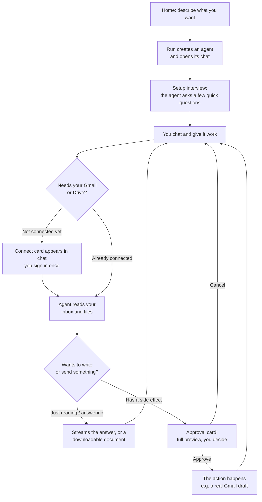
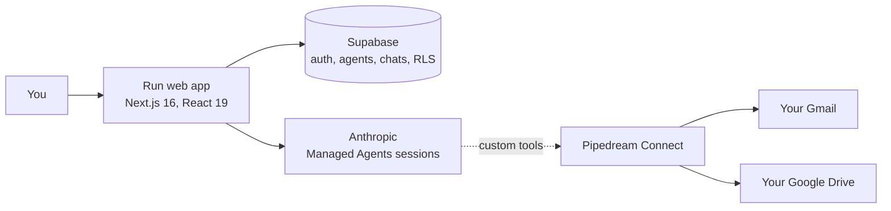

# Run

**Run lets you build your own AI assistant just by describing it. No setup, no
technical skills.**

Think of an agent as a personal assistant you create in one sentence. Tell Run
what you need ("help me keep on top of my inbox"), and it builds you an assistant
you talk to like a person. It connects to your own Gmail and Google Drive, so it
works on your real emails and files, not a demo. It can go through your inbox,
draft replies, find and read your documents, and turn them into new ones.

It is safe by default. Your assistant reads things on its own, but before it
sends or changes anything, it shows you exactly what it will do and waits for
your okay.

And there is nothing to configure. No forms, no flowcharts, no settings to learn.
You build your assistant and use it in the very same place: a conversation.

## What makes it different

- **You build it by talking.** Describe the job in one sentence and your
  assistant exists. It even asks you a couple of questions to set itself up.
  There is no canvas, no wiring, and nothing to learn.
- **It works on your real stuff.** The point is not a clever chatbot. It is an
  assistant that acts on your own inbox and your own files, through accounts you
  connect.
- **It always asks before it acts.** It reads on its own, but anything that sends
  or changes something stops and shows you a preview first. That is what makes it
  okay to trust it with a real account.

## The end-to-end journey

Here is the whole path, from a blank screen to a real email drafted in your
Gmail.



Step by step:

1. **Describe it.** On the home screen you get a single prompt box: *"what do you
   want to create?"* You type something like *"Summarize my inbox each morning
   and flag anything that needs a reply."* Run creates an agent, gives it a clean
   name, and drops you straight into a chat with it.
2. **Let it set itself up.** On the first turn the agent introduces itself and
   asks a couple of quick questions (tap-to-answer, with a free-text option) to
   understand exactly what you want and how you want it. Those answers shape how
   it behaves from then on.
3. **Give it work.** You chat normally. As the agent works it streams its
   thinking and shows a live line for each step ("Searching your inbox from the
   last 2 days", then "Read an email"), so you can see what it is doing.
4. **Connect your tools inline.** The first time the agent needs your Gmail or
   Drive, a Connect card appears right in the conversation. You sign in once
   through a secure popup, and the agent picks up automatically where it left
   off. Everyone connects their own accounts.
5. **It reads freely.** Searching and reading your inbox and Drive happen on
   their own, no approval needed, because reading has no side effect.
6. **It asks before it writes.** When the agent wants to do something with a
   consequence (create a Gmail draft, for example), it pauses and shows an
   approval card with the complete draft. Nothing is created until you press
   Approve. Cancel and it simply carries on.
7. **It hands back real output.** Answers stream into the chat. When you ask for
   a document, the agent produces a titled Markdown file that appears as a card
   with a preview and a Download button. Approved email drafts land in your
   actual Gmail, one click from sent.
8. **You can hand it files too.** Attach a document or a screenshot to a message
   (paperclip, drag-and-drop, or paste) and the agent reads it as reference for
   that turn.
9. **Come back any time.** Each agent lives in the sidebar as an ongoing chat.
   Reopen it and the whole conversation is there, timestamped, with date
   dividers, so you pick up exactly where you left off.

## How it is structured

Run is a single, focused app. These are the surfaces you move between:

- **Sidebar** (always present): your list of agents, plus "New agent". Each agent
  is one entry you can jump back into.
- **Home** (`/`): the prompt box where you create a new agent by describing it.
- **Chat thread** (`/chat/[agent]`): the heart of the product. A ChatGPT-style
  view with a pinned header and composer and a scrolling message list, this is
  where you talk to an agent, watch it work, approve its actions, and read its
  output.
- **Configure panel**: a slide-over from the chat header for tuning an agent
  without leaving the conversation. It is grouped into **Profile** (name and
  personality), **Behavior** (instructions and model), **Connections** (Gmail and
  Drive), a read-only record of the setup interview, and a delete action.
- **Connections**: your own Gmail and Drive links, offered inline when an agent
  needs them and also managed from the Configure panel.

### The agent model

The mental model is a worker and their tasks:

- An **agent** is a durable worker. Its role, instructions, connected accounts,
  and personality define who it is.
- A **conversation** is a task it is doing. The runtime supports many
  conversations per agent (an agent is separate from its chat sessions), which is
  the natural structure for "one worker, many jobs over time".

A good agent is a coherent cluster of related work ("my email assistant"), not a
do-everything bot, because an agent's competence is exactly its configured
instructions, tools, and connected data.

## Trust and safety

Because agents act on real accounts, safety is built into the loop, not bolted
on:

- **Reads are free, writes ask first.** The run loop auto-runs only an explicit
  allowlist of read-only tools. Anything else, including any tool that could have
  a side effect, is gated behind your approval by default.
- **Everything an agent reads is treated as data, not instructions.** A fixed
  security policy on every agent defends against prompt injection hidden inside an
  email, file, or web page. The real guarantee is still the approval gate: an
  injected instruction can never reach a side effect without you tapping Approve.
- **Agents stay on task.** Each agent politely declines requests clearly outside
  its job and points you back to what it can help with.
- **Per-user connections.** Each person connects their own Gmail and Drive; an
  agent acts on the signed-in user's accounts, scoped by row-level security.

## Under the hood



- **Front end:** Next.js 16 (App Router), React 19, Tailwind CSS v4. The design
  system is documented in [docs/styleguide.md](./docs/styleguide.md).
- **Data and auth:** Supabase (Postgres, authentication, storage, and row-level
  security that scopes every read and write to its owner).
- **Agents:** the Anthropic API's Managed Agents, one persistent session per chat
  thread, which gives each conversation native multi-turn memory. The chat
  streams to the browser as newline-delimited JSON, so you see thinking, activity,
  approval cards, and the final reply as they happen.
- **Connections:** Pipedream Connect proxies each user's own Gmail and Drive. The
  agent's Gmail and Drive abilities are custom tools executed through that proxy,
  which is what makes the read-freely / ask-before-writing split possible.

## Project status

The core loop works end to end on real accounts: describe an agent, connect your
Gmail and Drive, have it read your inbox and files, get genuinely useful output
(inbox summaries, document answers and critiques, drafted replies, downloadable
documents), and approve any action before it happens. Drafts approved in the chat
are created as real Gmail drafts.

Agents can also be taught. You can give one a note or a file it always knows,
whether that is how you write, the facts you repeat, or the words your team
uses, and it shows up in the very next reply. Sources belong to you rather than
to a single agent, so one voice guide can feed several of them. Getting started
needs no administrator, and how many agents you can create is set by a plan.

Natural next steps: giving every person their own space with their own plan,
deploying for more users, exporting documents to Google Docs and PDF, multiple
conversations per agent in the UI, and scheduled runs so an agent can work on
its own (for example a daily inbox summary that arrives without you asking).

The full, plain-English history, session by session, lives in
**[PROGRESS.md](./PROGRESS.md)**, updated at the end of every work session.

## Getting started

Install dependencies and run the development server:

```bash
npm install
npm run dev
```

Copy `.env.local.example` to `.env.local` and fill in your own Supabase,
Anthropic, and Pipedream keys, then open
[http://localhost:3000](http://localhost:3000).

## Checks

```bash
npm run lint       # ESLint
npx tsc --noEmit   # TypeScript
npm run build      # production build
```

## Deploying

The app is a standard Next.js project and deploys cleanly to Vercel:

1. **Supabase:** create a project and apply every migration in
   `supabase/migrations/` in filename order (SQL editor or CLI). Turn email
   confirmation on or off to taste under Auth settings.
2. **Vercel:** import the repo and set the environment variables from
   `.env.local.example`. `NEXT_PUBLIC_APP_URL` must be the deployed URL (it is
   used for the OAuth redirects).
3. **Pipedream:** set `PIPEDREAM_ENVIRONMENT=production` and make sure the
   Pipedream project has a production environment with the Gmail and Google Drive
   apps enabled.
4. **First run:** sign up. The first account can be promoted to admin by setting
   `profiles.role = 'admin'` in Supabase, which unlocks the one-time setup of the
   shared agent runtime (the Anthropic environment). After that, anyone can create
   an agent from the home screen, connect their own Gmail or Drive when the agent
   asks, and start chatting.

Chat turns run synchronously and a tool-using turn can take a little while; the
chat route sets `maxDuration = 300`, which needs a Vercel plan that allows
300-second function durations.
