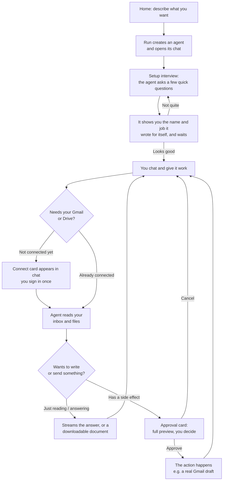
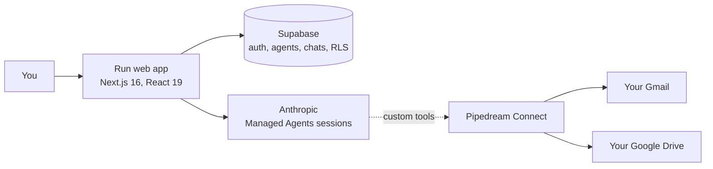

# Run

**Run turns a sentence into an assistant.**

Say what you want, like *"help me keep on top of my inbox"*, and you have one.
You talk to it like a person. It works on your real Gmail and Google Drive: it
reads your inbox, drafts replies, finds your documents, and turns them into new
ones.

There is nothing to set up. Describing what you want is the setup.

## What makes it different

- **You build it by talking.** Say what you need in one sentence and it exists.
  It asks a couple of questions, and that is the whole setup.
- **It works on your real email and files.** Your actual inbox, your actual
  Drive, through accounts you connect yourself.
- **It asks before it acts.** It reads freely, but anything that sends or
  changes something stops and shows you the whole thing first.

## The end-to-end journey

Here is the whole path, from a blank screen to a real email drafted in your
Gmail.



Step by step:

1. **Say what you want.** One box, one sentence: *"Summarize my inbox each
   morning and flag anything that needs a reply."* You get an agent and a chat
   with it.
2. **It asks a few questions.** Enough to understand the job properly. Tap an
   answer or type your own.
3. **It shows you what it understood.** Its name and its job, before it does
   anything. Change either one, or tell it what to fix. Nothing happens until
   you agree.
4. **Give it work.** Chat with it normally, and watch each step as it goes:
   *"Searching your inbox from the last 2 days"*, then *"Read an email"*.
5. **Sign in when it needs you to.** The first time it wants your Gmail or
   Drive, it asks. You sign in once and it carries on from where it stopped.
   Everyone connects their own accounts.
6. **It reads on its own, and asks before it acts.** Looking through your inbox
   and files needs no permission. Anything that sends or changes something stops
   and shows you the whole thing first.
7. **You get real things back.** Answers, documents you can download, and
   drafts waiting in your Gmail.
8. **Send it files.** Attach a document or a screenshot and it reads it.
9. **Keep track of your usage.** How much of the month you have left, and what
   your agents spent it on.

## How it is structured

Run is a single, focused app. These are the surfaces you move between:

- **Sidebar** (always present): your list of agents, plus "New agent". Each agent
  is one entry you can jump back into.
- **Home** (`/`): the prompt box where you create a new agent by describing it.
- **Chat thread** (`/chat/[agent]`): the heart of the product. A ChatGPT-style
  view with a pinned header and composer and a scrolling message list, this is
  where you talk to an agent, watch it work, approve its actions, and read its
  output.
- **Configure panel**: a column that docks beside the chat for tuning an agent
  without leaving the conversation, or losing sight of it. It is grouped into **Profile** (name and
  personality), **Behavior** (instructions and model), **Connections** (Gmail and
  Drive), a read-only record of the setup interview, and a delete action.
- **Connectors** (`/connectors`): your own Gmail and Drive links, offered inline
  when an agent needs them, and managed here or from the Configure panel.

### The agent model

The mental model is a worker and their tasks:

- An **agent** is a durable worker. Its role, instructions, connected accounts,
  and personality define who it is.
- A **conversation** is a task it is doing. The runtime supports many
  conversations per agent (an agent is separate from its chat sessions), which is
  the natural structure for "one worker, many jobs over time".

A good agent is a coherent cluster of related work ("my email assistant"), not a
do-everything bot, because an agent's competence is exactly its configured
instructions, tools, and connected data.

## Trust and safety

These agents work on your actual email and files, so the interesting question is
not what they can do. It is what they do without asking:

- **It asks before it starts, not just before it writes.** Setting an agent up
  ends with it showing you the name and the job it wrote for itself, and waiting.
  Before this, the name was chosen for you and never shown, and your answers were
  written into its instructions without you reading a word, so a misunderstanding
  only surfaced after the agent had acted on it.
- **Reads are free, writes ask first.** The run loop auto-runs only an explicit
  allowlist of read-only tools. Anything else, including any tool that could have
  a side effect, is gated behind your approval by default.
- **Everything an agent reads is treated as data, not instructions.** A fixed
  security policy on every agent defends against prompt injection hidden inside an
  email, file, or web page. The real guarantee is still the approval gate: an
  injected instruction can never reach a side effect without you tapping Approve.
- **Agents stay on task.** Each agent politely declines requests clearly outside
  its job and points you back to what it can help with.
- **Per-user connections.** Each person connects their own Gmail and Drive; an
  agent acts on the signed-in user's accounts, scoped by row-level security.

## When something goes wrong

Agent products fail differently from ordinary software. Models are
non-deterministic, tools are other people's APIs, and a single turn can run for
minutes. Failure is not an edge case here, so it gets designed rather than
handled.

- **You never meet the machine.** No exception text, no status codes, no
  payloads. If nobody wrote the sentence for a person to read, it does not reach
  the screen. Every failure passes through one translation layer, so the wording
  cannot drift apart across the app.
- **It says whose fault it is.** "Something went wrong on our end" and "That
  message is too long to send" lead to completely different next moves, and that
  is the thing a raw error never tells you.
- **A failed turn is not a broken conversation.** The chat stays usable, and
  trying again repeats the same turn without you retyping anything. Once it
  works, the failure disappears rather than sitting in your history.
- **The agent's voice and Run's voice stay separate.** "I could not open that
  file" is the agent. "Something went wrong on our end" is us. Dressing our own
  bug in the agent's voice would make the agent look unreliable for something it
  did not do.
- **Errors have two audiences.** A tool failure is handed to the agent, so it can
  explain in its own words or try another way. Infrastructure failures never are,
  because a model cannot see them and will invent an explanation instead.

## Under the hood



- **Front end:** Next.js 16 (App Router), React 19, Tailwind CSS v4. The design
  system is documented in [docs/styleguide.md](./docs/styleguide.md).
- **Data and auth:** Supabase (Postgres, authentication, storage, and row-level
  security that scopes every read and write to its owner).
- **Agents:** the Anthropic API's Managed Agents, one persistent session per chat
  thread, which gives each conversation native multi-turn memory. The chat
  streams to the browser as newline-delimited JSON, so you see thinking, activity,
  approval cards, and the final reply as they happen.
- **Connections:** Pipedream Connect proxies each user's own Gmail and Drive. The
  agent's Gmail and Drive abilities are custom tools executed through that proxy,
  which is what makes the read-freely / ask-before-writing split possible.

## Project status

The core loop works end to end on real accounts: describe an agent, connect your
Gmail and Drive, have it read your inbox and files, get genuinely useful output
(inbox summaries, document answers and critiques, drafted replies, downloadable
documents), and approve any action before it happens. Drafts approved in the chat
are created as real Gmail drafts.

Agents can also be taught. You can give one a note or a file it always knows,
whether that is how you write, the facts you repeat, or the words your team
uses, and it shows up in the very next reply. Sources belong to you rather than
to a single agent, so one voice guide can feed several of them, and a source can
be set to apply to every agent you own so you write it once and edit it once.
Your Gmail and Drive connectors have their own page, since they belong to you
rather than to any one agent. Getting started needs no administrator, and how
many agents you can create is set by a plan.

Configuring an agent happens beside the conversation rather than over it: the
panel slides in as its own column and the chat stays readable, because the
reason to open it is usually something the agent just said.

Everyone can now see what they have used. A meter beside your account shows how
much of the month is left and opens into a history of every run an agent has
done for you, including runs by agents you have since deleted. Underneath it,
the app now records what a conversation actually costs: it had been counting
only the small uncached part of each prompt and missing almost all of it.

Setting an agent up ends with a checkpoint rather than the agent simply
starting. It shows you the name and the job it wrote for itself, you edit either
one or tell it what to change, and nothing runs until you agree.

Failures have been designed rather than left to chance. Every error in the chat
now reaches you as a plain sentence with one thing to press, instead of whatever
string an exception happened to carry.

The app has also been through two performance passes. Every page now paints
instantly and fills in as its data arrives, instead of showing nothing until
the slowest query finished. Checking who you are happens locally instead of
over the network, which used to sit in front of every page and every message.
Pages you are likely to click next are fetched before you click them, and
opening a chat asks the database for half of what it used to. Signing in now
reacts the moment you press the button.

The pages themselves have been made consistent. Settings, Knowledge and
Connectors sit in the same centered column the chat uses, so every screen has
the same shape. The Connectors page tells the whole truth about what an agent
runs on: your Gmail and Drive, and a Claude row for the AI behind every agent,
web search included. Buttons explain themselves when you hover, empty pages
say in one quiet line what will live there, and most of the words on these
pages got shorter.

Natural next steps: giving every person their own space with their own plan,
deploying for more users, exporting documents to Google Docs and PDF, multiple
conversations per agent in the UI, and scheduled runs so an agent can work on
its own (for example a daily inbox summary that arrives without you asking).

The full, plain-English history, session by session, lives in
**[PROGRESS.md](./PROGRESS.md)**, updated at the end of every work session.

## Getting started

Install dependencies and run the development server:

```bash
npm install
npm run dev
```

Copy `.env.local.example` to `.env.local` and fill in your own Supabase,
Anthropic, and Pipedream keys, then open
[http://localhost:3000](http://localhost:3000).

## Checks

```bash
npm run lint       # ESLint
npx tsc --noEmit   # TypeScript
npm run build      # production build
```

## Deploying

The app is a standard Next.js project and deploys cleanly to Vercel:

1. **Supabase:** create a project and apply every migration in
   `supabase/migrations/` in filename order (SQL editor or CLI). Turn email
   confirmation on or off to taste under Auth settings.
2. **Vercel:** import the repo and set the environment variables from
   `.env.local.example`. `NEXT_PUBLIC_APP_URL` must be the deployed URL (it is
   used for the OAuth redirects).
3. **Pipedream:** set `PIPEDREAM_ENVIRONMENT=production` and make sure the
   Pipedream project has a production environment with the Gmail and Google Drive
   apps enabled.
4. **First run:** sign up. The first account can be promoted to admin by setting
   `profiles.role = 'admin'` in Supabase, which unlocks the one-time setup of the
   shared agent runtime (the Anthropic environment). After that, anyone can create
   an agent from the home screen, connect their own Gmail or Drive when the agent
   asks, and start chatting.

Chat turns run synchronously and a tool-using turn can take a little while; the
chat route sets `maxDuration = 300`, which needs a Vercel plan that allows
300-second function durations.
